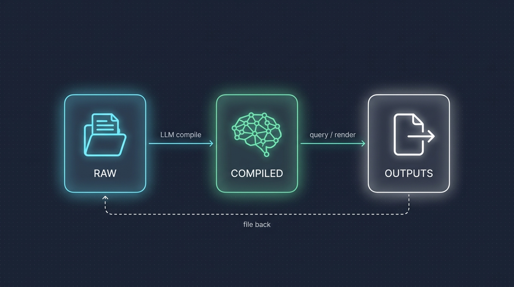

# `obs` — a knowledge base that writes itself

<p align="center">
  
</p>

A Unix CLI for Obsidian vaults that implements Andrej Karpathy's [LLM Wiki pattern](https://gist.github.com/karpathy/442a6bf555914893e9891c11519de94f): drop raw sources in, an LLM compiles them into an interlinked wiki, answers you save compound over time.

Works as a plain CLI, as a Claude Code skill pack, and as an MCP server for Claude Desktop / Cursor / Windsurf.

[](LICENSE)

> Unofficial, community-built. Not affiliated with or endorsed by Obsidian.

---

## The problem

You have:

- 20 open browser tabs you meant to read.
- A folder of PDFs you never opened.
- 500 notes in Obsidian that never link to each other.
- A chat with Claude yesterday that had your best thinking in it. You can't find it.

Every AI chat starts from zero. Every note app is a graveyard. Every source you add is isolated from every source you added before.

## What `obs` gives you

- **A wiki that compounds.** Drop a URL, PDF, repo, transcript, or image. The LLM extracts concepts, cross-references everything you already have, and files it. Source #50 doesn't sit alone — it links to ~10 existing pages and updates them.
- **Answers that stick.** Ask a question. The answer is saved as a new note with wikilinks. Next question uses it as context.
- **A Unix tool, not a plugin.** Pipeable, scriptable, cron-able, CI-friendly. Works when Obsidian isn't running. Works headless on a server.
- **100+ Obsidian-native operations.** Tags, tasks, links, daily notes, templates, canvas, bases, graph analysis — same vault Obsidian sees.
- **Two personalities in one tool.** `obs kb ingest` as a command. `/clip <url>` as a Claude Code slash command. Same underlying logic.

## Why `obs`

Most LLM-wiki tools are one of two shapes — and both leave something on the table.

**Obsidian plugins** give you polished UI but require the app running. No cron, no CI, no pipes, no headless servers. They live inside the app.

**Standalone CLIs** are scriptable and composable but lack Obsidian's vault primitives — tags, tasks, canvas, bases, graph — so they produce markdown that's technically compatible but functionally isolated.

`obs` is both:

- **A Unix CLI.** Pipeable, scriptable, cron-able, CI-friendly. Works headless. Works when Obsidian isn't running.
- **100+ Obsidian-native operations.** Tags, tasks, links, daily notes, templates, canvas, bases, graph analysis — same files Obsidian sees.
- **A built-in MCP server.** AI tools plug in directly.
- **A Claude Code skill pack.** Slash commands mirror every CLI command.

On the roadmap, three features nobody has shipped yet:

- `obs kb verify` — fact-check every claim on a concept page against its cited sources; flag hallucinations with `[!unverified]` callouts
- `obs kb eval` — self-test by generating held-out Q&A, measure the wiki's answer accuracy, track IQ over time
- `obs kb autohunt` — overnight research loop that hunts sources for your open questions and hands you a morning digest

---

## 2-minute quickstart

### 1. Install

```bash
# Requires Node 18+
pnpm add -g obsidian-vault-cli          # or: npm i -g obsidian-vault-cli

# Verify
obs --version
```

### 2. Point `obs` at your vault

```bash
obs init                                 # Auto-detects Obsidian vaults
# or
obs vault config defaultVault /path/to/vault
```

### 3. Start the loop

```bash
obs kb init                              # Scaffold raw/ compiled/ outputs/

obs kb ingest https://karpathy.ai/...    # Add a source
obs kb compile                           # Fold it into the wiki
obs kb ask "what does my KB say about X?" # Query — answer saved to outputs/

obs kb stats                             # See the shape of your KB
```

You now have a vault structured like this:

```
your-vault/
├── raw/              sources you ingested (immutable)
│   ├── articles/
│   ├── papers/
│   ├── repos/
│   └── INGEST-LOG.md
├── compiled/         LLM-written wiki
│   ├── 00-INDEX.md
│   ├── concepts/     cross-referenced concept pages
│   ├── people/
│   └── orgs/
└── outputs/          answers, slides, charts, lint reports
    ├── answers/
    ├── slides/
    └── lint/
```

<p align="center">
  
</p>

Open the vault in Obsidian — everything is plain markdown with `[[wikilinks]]`.

---

## Use it with Claude Code

`obs` ships with a Claude Code skill pack. Every `obs kb` CLI command has a slash-command twin you can invoke in Claude Code conversations.

### Install the skill pack

```bash
# Clone and link if you haven't already
git clone https://github.com/markfive-proto/obsidian-vault-cli.git
cd obsidian-vault-cli && pnpm install && pnpm build && pnpm link --global

# Install a pack globally (available in all Claude Code projects)
obs skills install knowledge-base          # The Karpathy pack (ingest/compile/qa/lint/render)
obs skills install capture                 # Brain-dump + quick-capture cognitive pack

# Or install to the current project only
obs skills install knowledge-base --local
```

### Available slash commands

Once installed, in any Claude Code session:

| You type | Claude does |
|---|---|
| `/clip <url>` | Fetches the page, cleans it to markdown, files it in `raw/articles/` |
| `/paper <arxiv-or-pdf>` | Extracts text + figures from a PDF into `raw/papers/` |
| `/repo <github-url>` | Fetches README + key files into `raw/repos/` |
| `/transcript <youtube-url>` | Pulls auto-captions into `raw/transcripts/` |
| `/compile` | Scans raw/ for new sources, generates/updates concept pages |
| `/ask <question>` | Queries the wiki, saves the answer to `outputs/answers/` |
| `/deep <topic>` | Multi-step research dive across the wiki |
| `/lint` | Finds broken links, orphans, missing frontmatter, gaps |
| `/slides <topic>` | Renders a Marp slide deck |
| `/brief <topic>` | Renders a 1-page executive brief |
| `/chart <dataset>` | Renders a matplotlib chart |

The CLI (`obs kb ingest`, `obs kb compile`, etc.) and the slash commands share the same underlying skills. Use whichever fits your workflow — pipes in the terminal, conversational in Claude Code.

---

## Connect it to Claude Desktop / Cursor / Windsurf (MCP)

`obs` includes a built-in [MCP](https://modelcontextprotocol.io) server (`obs-mcp`) so any AI tool that speaks MCP can use your vault as a tool.

### Claude Desktop

1. Open your Claude Desktop config:

   ```bash
   # macOS
   open ~/Library/Application\ Support/Claude/claude_desktop_config.json

   # Windows
   notepad %APPDATA%\Claude\claude_desktop_config.json
   ```

2. Add the `obs` server:

   ```json
   {
     "mcpServers": {
       "obs": {
         "command": "obs-mcp",
         "args": ["--vault", "/absolute/path/to/your/vault"]
       }
     }
   }
   ```

3. Restart Claude Desktop. You'll see an 🔨 icon in the input bar — click it to confirm `obs_*` tools are listed.

### Cursor

Add to `~/.cursor/mcp.json` (or **Settings → MCP → Add Server**):

```json
{
  "mcpServers": {
    "obs": {
      "command": "obs-mcp",
      "args": ["--vault", "/absolute/path/to/your/vault"]
    }
  }
}
```

### Windsurf

Add to `~/.codeium/windsurf/mcp_config.json`:

```json
{
  "mcpServers": {
    "obs": {
      "command": "obs-mcp",
      "args": ["--vault", "/absolute/path/to/your/vault"]
    }
  }
}
```

### Claude Code (CLI)

```bash
claude mcp add obs obs-mcp --vault /absolute/path/to/your/vault
# Then in any Claude Code session:
claude
> /mcp              # confirms obs is connected
> list my concept pages
```

### What the AI can now do

21 MCP tools are registered (15 vault ops + 6 KB ops):

**Vault ops:** `obs_vault_info`, `obs_read_note`, `obs_write_note`, `obs_create_note`, `obs_search`, `obs_list_files`, `obs_manage_tags`, `obs_manage_properties`, `obs_daily_note`, `obs_list_links`, `obs_list_files_filtered`, `obs_links_path`, `obs_links_orphans`, `obs_vault_wordcount`

**KB ops (new):** `obs_kb_init`, `obs_kb_stats`, `obs_kb_list_raw`, `obs_kb_list_concepts`, `obs_kb_list_outputs`, `obs_kb_append_ingest_log`

Ask any of the above AI tools: *"Show me my KB stats and list 5 concept pages."* It will call the MCP tools, no prompting needed.

---

## Commands cheatsheet

The KB loop:

```bash
obs kb init                              # Scaffold raw/ compiled/ outputs/
obs kb ingest <url|file>                 # Add a source
obs kb compile                           # raw/ → compiled/ concept pages
obs kb ask "question"                    # Query, save answer
obs kb lint                              # Broken links / orphans / gaps
obs kb stats                             # Health summary
obs kb list raw|concepts|outputs         # Browse
```

The roadmap uniques:

```bash
obs kb verify <concept>                  # Fact-check against sources  [phase 3]
obs kb eval                              # Self-test wiki IQ           [phase 3]
obs kb autohunt                          # Overnight research daemon   [phase 3]
obs kb publish <concept> --format blog   # Blog / tweet / newsletter   [phase 3]
obs kb watch                             # Auto-recompile on raw/ change [phase 2]
```

Everyday vault ops:

```bash
obs vault info                           # Vault name, stats, plugins
obs files list --since 7d                # Files modified in last 7 days
obs search content "TODO"                # Full-text search
obs tags all --sort count                # Tag frequency
obs links broken                         # Dead wikilinks
obs links orphans                        # Unlinked notes
obs daily create                         # Today's daily note
obs tasks pending --json | jq            # All unchecked tasks
```

Every command supports `--json` for scripting and `--help` for details. See [`docs/commands.md`](./docs/commands.md) or run `obs --help` for the full reference.

---

## Cognitive skill packs

Beyond the knowledge-base pack, `obs` ships six cognitive skill packs that turn Claude Code into a thinking partner:

| Pack | Slash commands | What it does |
|---|---|---|
| **capture** | `/dump`, `/capture`, `/quick` | Brain dumps, rapid-fire capture |
| **clarify** | `/articulate`, `/expand`, `/simplify` | Rewrite messy notes, distill to core |
| **connect** | `/connect`, `/trace`, `/drift` | Find hidden connections, track evolution |
| **reflect** | `/emerge`, `/challenge`, `/growth` | Cluster ideas, challenge assumptions |
| **act** | `/next`, `/decide`, `/graduate` | Priorities, decisions, promote ideas |
| **review** | `/today`, `/closeday`, `/weekly` | Daily and weekly rituals |
| **knowledge-base** (new) | `/clip`, `/paper`, `/compile`, `/ask`, `/lint`, `/slides`, `/brief`, ... | Karpathy LLM-Wiki workflow |

```bash
obs skills list                           # Browse all packs
obs skills info knowledge-base            # See a pack's commands
obs skills install knowledge-base         # Install globally
obs skills install knowledge-base --local # Install to current project
```

---

## Roadmap

**Phase 1 — shipped:**
- `obs kb init / stats / list` (native)
- `obs kb ingest / compile / ask / lint / render / verify / eval / autohunt` (stubs that delegate to the Claude Code skills; full logic in the skills today)
- 6 new MCP tools for the KB loop
- Claude Code skill pack (ingest, compile, qa, lint, render)

**Phase 2 — next:**
- Native LLM-backed `ingest / compile / ask / lint` via LiteLLM or Anthropic SDK
- SHA-256 change detection for incremental compile
- markitdown / pdftotext ingest for PDF, docx, pptx
- `obs kb watch` daemon
- MCP tools for all LLM-backed ops

**Phase 3 — the uniques:**
- `obs kb verify <concept>` — fact-check each claim on a concept page against its cited sources; annotate hallucinations with `[!unverified]` callouts
- `obs kb eval` — generate held-out Q&A from sources, measure the wiki's answer accuracy, write a weekly IQ trend
- `obs kb autohunt` — overnight research loop that collects open questions from concept pages, hunts for sources, recompiles, writes a morning digest
- `obs kb publish` — render a concept or answer as a blog draft, tweet thread, newsletter, or LinkedIn post

These three are the defensible wedge; nobody in the LLM-Wiki space has shipped them.

---

## JSON mode & scripting

All commands support `--json`:

```bash
obs vault stats --json | jq '.fileCount'
obs tasks pending --json | jq -r '.[] | [.file, .line, .text] | @csv'
obs kb stats --json | jq '.danglingWikilinks'
obs kb list concepts --json | jq -r '.[]'
```

---

## Global options

| Flag | Description |
|---|---|
| `--vault <path>` | Override the configured vault |
| `--json` | Machine-readable output |
| `--help` | Help for any command |
| `--version` | Print CLI version |

---

## Development

```bash
git clone https://github.com/markfive-proto/obsidian-vault-cli.git
cd obsidian-vault-cli
pnpm install
pnpm build             # production build
pnpm dev               # watch mode
pnpm test              # vitest (67 tests currently)
pnpm link --global     # expose `obs` and `obs-mcp` binaries
```

Code layout:

```
src/
├── index.ts           CLI entrypoint (commander)
├── commands/          one file per command group (kb, files, search, tags, ...)
├── mcp/               MCP server + tool registration
├── utils/             frontmatter, markdown, output helpers
└── vault.ts           Vault class — direct file I/O, safe path resolution

skills/                Claude Code skill packs (one folder per skill)
├── knowledge-base/    (via the 5 subfolders: ingest, compile, qa, lint, render)
├── capture/ clarify/ connect/ reflect/ act/ review/
└── obs/               CLI reference skill
```

---

## Contributing

PRs welcome — especially:

- Phase 2 native implementations (look at `src/commands/kb.ts` — the stubs mark their intent with `printStub(...)`)
- Phase 3 features (`verify`, `eval`, `autohunt`)
- More ingest formats (epub, mhtml, rss)
- More render formats (Mermaid diagrams, flash-card exports, pandoc variants)
- New skill packs

```bash
# Fork, clone, branch
pnpm install
pnpm build && pnpm test
# Submit PR against main
```

If `obs` helps you, a star goes a long way — it's how others discover the project.

---

## Acknowledgments

- [Andrej Karpathy](https://gist.github.com/karpathy/442a6bf555914893e9891c11519de94f) for describing the LLM Wiki pattern.
- [Obsidian](https://obsidian.md) for the markdown-vault format that makes all of this possible.
- [Model Context Protocol](https://modelcontextprotocol.io) for the integration surface.
- [kepano/obsidian-skills](https://github.com/kepano/obsidian-skills) for pioneering agent-on-vault workflows.

---

## License

MIT — see [LICENSE](LICENSE).
